# Distributed Microservices — Point of Sale Platform (Java Quarkus)

A production-grade, highly resilient, and fully observable **microservices point of sale (POS) backend** built in **Java 21** using **Quarkus** reactive framework (v3.31.3). Designed around domain-driven service boundaries following Clean Architecture and CQRS principles, each service runs as an **independent JVM process** with its own gRPC server, database connection pool, caching layer, and Flyway migrations.

Each retail and identity business domain — Users, Roles, Cashiers, Merchants, Categories, Products, Orders, Order Items, Transactions — lives in its own self-contained Maven module as a separate microservice. These services communicate synchronously via high-performance **gRPC** protocols and asynchronously using **Apache Kafka** event propagation, exposing a unified reactive entry point through a **GraphQL API Gateway** powered by Quarkus SmallRye GraphQL. A dedicated **ClickHouse analytics layer** (stats-reader, stats-writer, stats-backfill) provides real-time business intelligence.

The platform is fortified with a **comprehensive observability suite** (Prometheus, Grafana, Loki, Jaeger, OpenTelemetry), **ClickHouse analytics**, **Redis caching** with custom telemetry for each service, and Kubernetes configurations ready for production auto-scaling.

---

## Key Features

| Domain             | Capabilities                                                                                                                                                                                              |
| :----------------- | :-------------------------------------------------------------------------------------------------------------------------------------------------------------------------------------------------------- |
| **Auth & Users**   | Secure registration, multi-factor login, stateless JWT access/refresh token lifecycle, password reset workflows, OTP email verification, and `/me` profile GraphQL query.                                 |
| **Roles & RBAC**   | Custom permission configuration, granular access control matrices, and sub-second permission evaluation cached via Redis.                                                                                 |
| **Merchants**      | Fully featured merchant onboarding, profile details management, business data registration, and merchant performance/transaction reports with full data restoration capabilities (soft delete & restore). |
| **Cashiers**       | Staff management per merchant, cashier activity tracking, sales performance analysis, and daily/monthly sales volume reporting.                                                                           |
| **Categories**     | Product taxonomy categorizations with soft-delete capabilities and quick search filters.                                                                                                                  |
| **Products**       | Inventory management, count in stock tracking, brand details, price structures, and multi-dimensional search filters (merchant, price range, brand, category).                                            |
| **Orders & Items** | Ledger checkout transactions, multi-item baskets with product price lookups, real-time total updates, monthly/yearly total revenue analytics, and sold-out product tracking.                              |
| **Transactions**   | Central financial audit register, global search filters, status tracking, monthly/yearly volume reports, and merchant/cashier sales breakdown.                                                            |
| **Email Worker**   | Kafka-driven asynchronous worker dispatching critical notification emails (OTPs, login alerts, merchant onboarding notices, and order receipts/invoices) via SMTP.                                        |
| **Observability**  | Multi-dimensional metrics (Prometheus + Grafana), log aggregation (Loki + Logback), end-to-end distributed tracing (Jaeger + OpenTelemetry), and resource monitors (Node, Kafka, Postgres Exporters).     |
| **ClickHouse Analytics** | Multi-component analytics pipeline (stats-reader, stats-writer, stats-backfill) with real-time business intelligence dashboards, fraud scoring, and historical data backfill.           |
| **Kafka Audit Trail**   | Transactional outbox pattern with idempotent producers, DLQ mechanism, and comprehensive consumer resilience (email dedup, fraud scoring, card event logging).                             |
| **Deployment**     | Local orchestration using Docker Compose (direct PostgreSQL + Redis), and auto-scaling Kubernetes manifests configured with Horizontal Pod Autoscalers (HPA).                                  |

---

## Architecture Overview

The platform implements a **Distributed Microservices** architecture. Each business service is a logical, decoupled, self-contained microservice inside its own Maven submodule, possessing its own independent gRPC boundary. A **Quarkus GraphQL API Gateway** acts as the unified edge router, exposing a single GraphQL schema (queries & mutations) and transforming client GraphQL operations into fast gRPC downstream communications via Quarkus gRPC clients.

### Core Architecture Principles

- **Service-Level Isolation**: Every microservice runs as an independent JVM process with its own gRPC server, database connection pool, caching layer, and Flyway migrations. No shared-memory coupling between services.
- **Clean Architecture & CQRS**: Separation of concerns using `Handler (gRPC) → Service (Command/Query) → Repository (Command/Query)` layers ensures business logic remains clean, performant, and framework-agnostic.
- **Reactive execution**: Powered entirely by Quarkus reactive engine and Mutiny, enabling high throughput with minimal resource footprints.
- **Direct DB Connections**: Each service manages its own Agroal connection pool directly to PostgreSQL — no PgBouncer dependency.
- **Event-Driven Resilience**: Apache Kafka decouples transaction events, ensuring side effects like email billing remain completely non-blocking. Transactional outbox pattern ensures no event loss.
- **OTel Telemetry Integration**: Standardized OpenTelemetry middleware injects trace IDs across gRPC boundaries, allowing seamless trace propagation from the client GraphQL gateway down to postgres operations.
- **ClickHouse Analytics**: Dedicated analytics pipeline (stats-reader, stats-writer, stats-backfill) for real-time business intelligence without impacting transactional database performance.

```mermaid
graph TB
    classDef client fill:#0f172a,stroke:#38bdf8,color:#e0f2fe,stroke-width:2px,font-weight:bold
    classDef gateway fill:#1e293b,stroke:#22d3ee,color:#cffafe,stroke-width:2px,font-weight:bold
    classDef domain fill:#1e1b4b,stroke:#818cf8,color:#e0e7ff,stroke-width:1.5px
    classDef infra fill:#172554,stroke:#60a5fa,color:#dbeafe,stroke-width:1.5px
    classDef obs fill:#052e16,stroke:#4ade80,color:#dcfce7,stroke-width:1.5px
    classDef event fill:#431407,stroke:#fb923c,color:#fed7aa,stroke-width:1.5px

    Client["Client Applications<br/>(Web / Mobile / API)"]:::client

    subgraph APIGateway["API Gateway — NGINX + Quarkus GraphQL Gateway"]
        direction LR
        GQL["GraphQL API Handler<br/>Port :5000"]:::gateway
        AuthMW["JWT Auth & Role<br/>Middleware"]:::gateway
    end

    Client -->|"GraphQL over HTTP"| APIGateway

    subgraph BusinessServices["Business Domain Services (Java Quarkus)"]
        direction TB

        subgraph IdentityDomain["Identity & Access"]
            AUTH["Auth Service<br/>JWT & BCrypt Server"]:::domain
            USER["User Service<br/>Profile Management"]:::domain
            ROLE["Role Service<br/>RBAC & Permissions"]:::domain
        end

        subgraph MerchantDomain["Merchant Management"]
            MERCH["Merchant Service<br/>Onboarding & Profiling"]:::domain
        end

        subgraph RetailDomain["Retail & Inventory Suite"]
            CASHIER["Cashier Service<br/>Staff & Sales Tracker"]:::domain
            CATEGORY["Category Service<br/>Product Taxonomy"]:::domain
            PRODUCT["Product Service<br/>Catalog & Inventory"]:::domain
        end

        subgraph OrderDomain["Checkout & Transactions"]
            ORDER["Order Service<br/>Checkout & Sales Ledger"]:::domain
            ORDER_ITEM["OrderItem Service<br/>Basket Details"]:::domain
            TXN["Transaction Service<br/>Central Audit Register"]:::domain
        end
    end

    GQL -->|"Quarkus gRPC Client"| AUTH
    GQL -->|"Quarkus gRPC Client"| USER
    GQL -->|"Quarkus gRPC Client"| ROLE
    GQL -->|"Quarkus gRPC Client"| MERCH
    GQL -->|"Quarkus gRPC Client"| CASHIER
    GQL -->|"Quarkus gRPC Client"| CATEGORY
    GQL -->|"Quarkus gRPC Client"| PRODUCT
    GQL -->|"Quarkus gRPC Client"| ORDER
    GQL -->|"Quarkus gRPC Client"| ORDER_ITEM
    GQL -->|"Quarkus gRPC Client"| TXN

    subgraph Infrastructure["Infrastructure Layer"]
        direction LR
        PG[("PostgreSQL<br/>POINT_OF_SALE DB")]|:::infra
        REDIS[("Redis Standalone<br/>:6381 — Distributed Cache")]|:::infra
        KAFKA[("Kafka Broker<br/>Event Bus")]:::infra
        CLICKHOUSE[("ClickHouse<br/>Analytics DB :8123")]:::infra
    end

    AUTH -->|"Reactive SQL Client"| PG
    USER -->|"Reactive SQL Client"| PG
    ROLE -->|"Reactive SQL Client"| PG
    MERCH -->|"Reactive SQL Client"| PG
    CASHIER -->|"Reactive SQL Client"| PG
    CATEGORY -->|"Reactive SQL Client"| PG
    PRODUCT -->|"Reactive SQL Client"| PG
    ORDER -->|"Reactive SQL Client"| PG
    ORDER_ITEM -->|"Reactive SQL Client"| PG
    TXN -->|"Reactive SQL Client"| PG

    AUTH -->|"Quarkus Redis client"| REDIS
    USER -->|"Quarkus Redis client"| REDIS
    ROLE -->|"Quarkus Redis client"| REDIS
    CASHIER -->|"Quarkus Redis client"| REDIS
    PRODUCT -->|"Quarkus Redis client"| REDIS
    GQL -->|"Quarkus Redis client"| REDIS

    subgraph EventConsumers["Event-Driven Consumers"]
        EMAIL["Email Service<br/>SMTP Notification Worker"]:::event
    end

    subgraph Analytics["ClickHouse Analytics Layer"]
        STATS_R["Stats Reader<br/>Query Service"]:::obs
        STATS_W["Stats Writer<br/>Pipeline Service"]:::obs
        STATS_B["Stats Backfill<br/>Historical Data"]:::obs
    end

    KAFKA -->|"Consume Events"| EMAIL
    KAFKA -->|"Stats Events"| STATS_W
    STATS_W -->|"Insert"| CLICKHOUSE
    STATS_R -->|"Query"| CLICKHOUSE

    subgraph Observability["Observability Stack"]
        direction LR
        PROM["Prometheus<br/>Metrics Engine"]:::obs
        LOKI["Loki<br/>Log Aggregator"]:::obs
        JAEGER["Jaeger<br/>Distributed Traces"]:::obs
        GRAFANA["Grafana<br/>Unified Dashboards"]:::obs
        OTEL["OTel Collector<br/>Telemetry Pipeline"]:::obs
        PROMTAIL["Promtail<br/>Log Shipper"]:::obs
        NODEX["Node Exporter<br/>System Metrics"]:::obs
        KAFKAX["Kafka Exporter<br/>Broker Metrics"]:::obs
        PGX["Postgres Exporter<br/>DB Performance"]:::obs
    end

    AUTH -->|gRPC| USER
    AUTH -->|gRPC| ROLE
    MERCH -->|gRPC| USER
    CASHIER -->|gRPC| USER
    ORDER -->|gRPC| PRODUCT
    ORDER -->|gRPC| TXN

    AUTH -.->|"Publish Verification Event"| KAFKA
    ORDER -.->|"Publish Order Event"| KAFKA

    AUTH -.->|"/metrics"| PROM
    USER -.->|"/metrics"| PROM
    ROLE -.->|"/metrics"| PROM
    MERCH -.->|"/metrics"| PROM
    CASHIER -.->|"/metrics"| PROM
    CATEGORY -.->|"/metrics"| PROM
    PRODUCT -.->|"/metrics"| PROM
    ORDER -.->|"/metrics"| PROM
    TXN -.->|"/metrics"| PROM
    GQL -.->|"/metrics"| PROM

    AUTH -.->|"OTLP Spans"| OTEL
    USER -.->|"OTLP Spans"| OTEL
    ROLE -.->|"OTLP Spans"| OTEL
    MERCH -.->|"OTLP Spans"| OTEL
    CASHIER -.->|"OTLP Spans"| OTEL
    CATEGORY -.->|"OTLP Spans"| OTEL
    PRODUCT -.->|"OTLP Spans"| OTEL
    ORDER -.->|"OTLP Spans"| OTEL
    TXN -.->|"OTLP Spans"| OTEL
    GQL -.->|"OTLP Spans"| OTEL

    OTEL -.-> JAEGER
    PROMTAIL -.-> LOKI
    NODEX -.-> PROM
    KAFKAX -.-> PROM
    PGX -.-> PROM
    PROM -.-> GRAFANA
    LOKI -.-> GRAFANA
    JAEGER -.-> GRAFANA
    KAFKA -.-> KAFKAX
    PG -.-> PGX
```

---

## Service Catalog

The platform consists of **15+ independent microservices** plus supporting infrastructure:

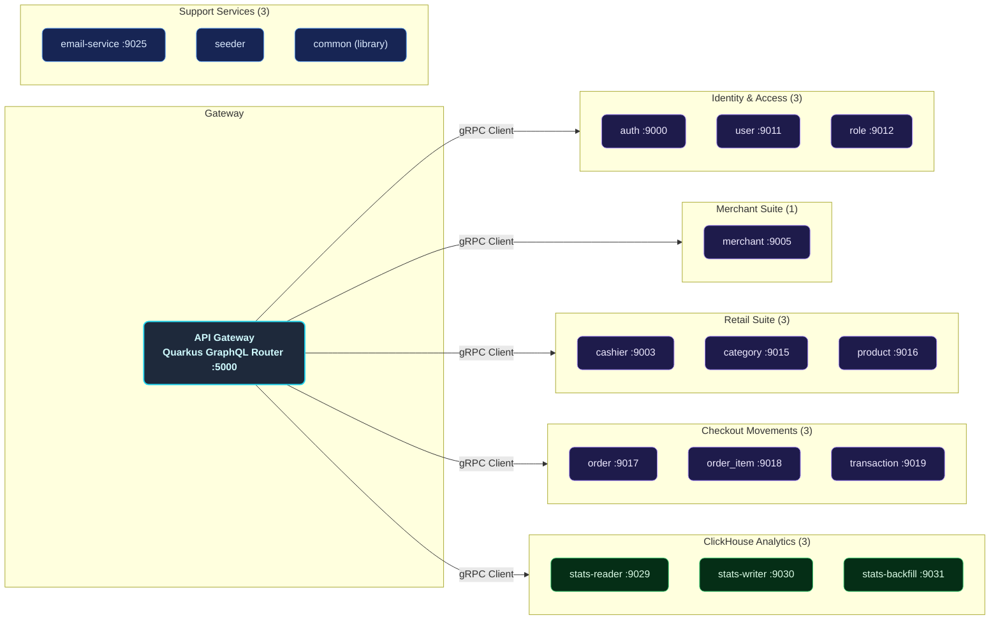

---

## Internal Service Architecture

Every logical business service is mapped as a decoupled submodule following structured clean architecture rules.

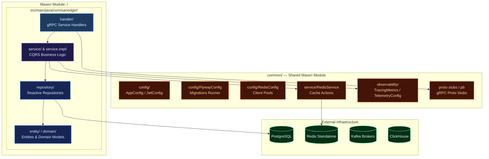

---

## Data & Event Flow

### Synchronous Flow (GraphQL Proxy & Cache Read-Through)

All external client API requests go through the GraphQL schema exposed by the Quarkus API Gateway. The API Gateway validates the JWT/API Key, resolves the requested query/mutation against the correct downstream gRPC microservice, checks the Redis cache, and fetches PostgreSQL directly if a cache miss occurs.

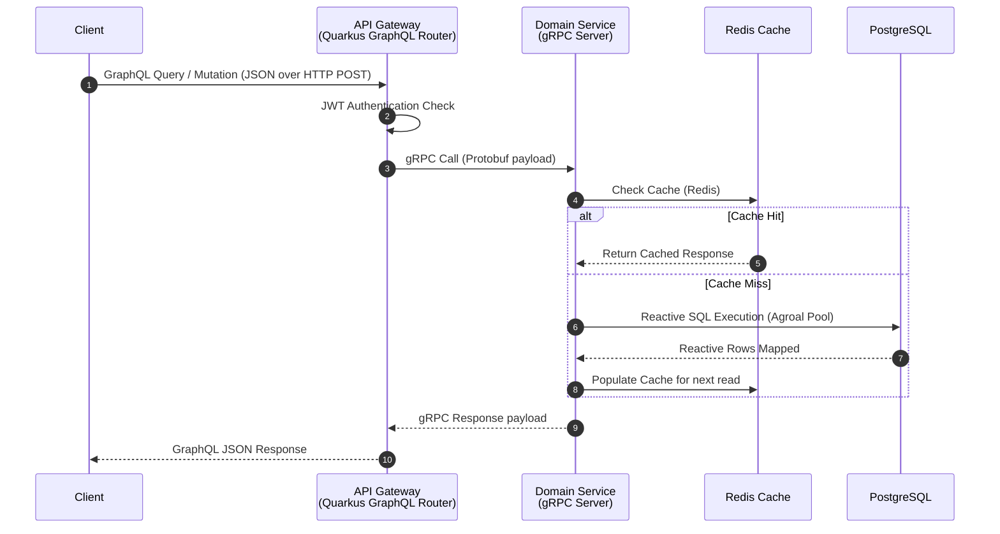

### Asynchronous Flow (Kafka Notification Event pipeline)

High-performance transaction modifications trigger background notification events published directly to Apache Kafka brokers. The isolated Email service listens to Kafka, maps the events, and contacts SMTP services.

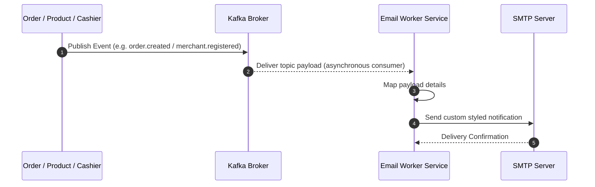

---

## Design Decisions & Known Limitations

Keputusan desain yang disengaja (bukan bug) — didokumentasikan agar tim tidak
"memperbaiki" perilaku berikut tanpa sadar:

| ID | Keputusan | Perilaku | Alasan |
|---|---|---|---|
| OT-3 | Status transaksi **tidak terkunci** | `updateTransaction` dapat mengubah `payment_status` kapan pun (dari pending → success/failed dan sebaliknya) tanpa state machine transisi | Audit status tidak dianggap kritikal untuk POS skala ini; mengubahnya menjadi state machine menambah kompleksitas tanpa kebutuhan bisnis eksplisit |
| OT-4 | Edge-case stok saat **trash item eksplisit** setelah trash order | Bila item di-trash eksplisit setelah order di-trash, stok item tersebut **tidak di-decrement** saat order di-restore (hanya item yang masih aktif yang ikut restore) | Perilaku disengaja: restore hanya memproses item aktif; item trash eksplisit adalah keputusan terpisah dari siklus hidup order. Konsekuensi: stok bisa bergeser dari "aktif = stok terpakai" pada skenario ini |
| OT-2 | `amount` transaksi **dihitung ulang server-side** | Nilai `amount` dari client tidak dipercaya; dihitung ulang dari order items + PPN 11% (`totalAmountWithTax`). Klaim yang kurang → `"Insufficient payment amount"` | Mencegah manipulasi nilai transaksi oleh client |

**Catatan Fase 11–15 (2026-08-14):** lihat `SUPER_PLANNING_MASTER.md` untuk
checklist lengkap — transactional outbox + retry/DLQ (F11), idempotency key
transaksi (F12), chaos & tracing Kafka (F13), SASL/TLS + acks=all + idempotent
producer (F14), serta order stats by-id & OTP GraphQL (F15).

---

## Observability Architecture

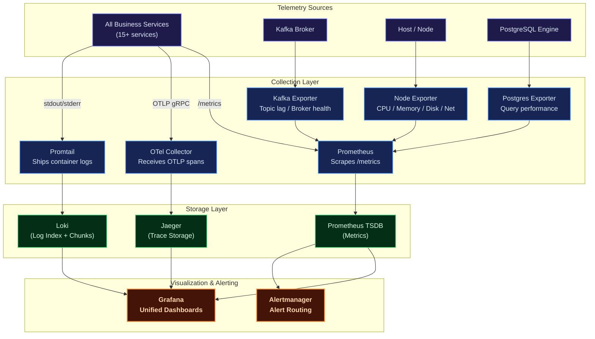

| Pillar       | Tool                   | Purpose                                                                                         |
| :----------- | :--------------------- | :---------------------------------------------------------------------------------------------- |
| **Metrics**  | Prometheus + Grafana   | Core metrics tracking (CPU, memory, request error rates, gRPC latencies, DB connection states). |
| **Logging**  | Loki + Logback         | Centralized structured JSON logger for indexing logs by service, queryable via LogQL.           |
| **Tracing**  | OpenTelemetry + Jaeger | Distributed system tracing across API gateway and internal gRPC services.                       |
| **Alerting** | Alertmanager           | Automated notification system triggered during latency hikes or service disconnects.            |

## Chaos Engineering Platform

The payment gateway features a built-in **reactive Chaos Engineering engine** to continuously test system resilience under failure conditions (database spikes, slow endpoints, CPU stress, and memory leaks).

### How It Works

The chaos engine is managed by [ChaosManager.java](./common/src/main/java/com/sanedge/common/chaos/ChaosManager.java) which dynamically watches the configuration file [chaos.yaml](./chaos.yaml) for modifications:

- **Dynamic Hot-Reloading**: Every 5 seconds, the engine checks `chaos.yaml` for changes. Adjusting values or toggling policies will update the running system instantly without requiring a service restart.

### Injection Mechanisms

1. **HTTP Routing Chaos** ([ChaosHttpMiddleware.java](./common/src/main/java/com/sanedge/common/chaos/ChaosHttpMiddleware.java)): Intercepts API router entry points to inject specified latency hikes or HTTP errors (e.g., status code 429 - rate limits).
2. **Database SQL Chaos** ([ChaosSqlProxy.java](./common/src/main/java/com/sanedge/common/chaos/ChaosSqlProxy.java)): Wraps database clients in a dynamic proxy, injecting database transaction latency or simulating sudden lock wait timeouts/deadlocks when queries hit matching tables.
3. **Resource Stress Chaos** ([ChaosResourceSabotage.java](./common/src/main/java/com/sanedge/common/chaos/ChaosResourceSabotage.java)): Spawns CPU/memory pressure routines to simulate container hardware throttling or memory exhaustion.

---

## Kafka Event Architecture

The platform uses **Apache Kafka (KRaft mode)** as the backbone for asynchronous email notifications and analytics event streaming. A **transactional outbox pattern** ensures reliable event delivery with at-least-once semantics.

### Topic Registry

| # | Topic | Producer | Event | Consumer |
|---|-------|----------|-------|----------|
| 1 | `email-service-topic-auth-register` | auth | User registration | email |
| 2 | `email-service-topic-auth-forgot-password` | auth | Password reset request | email |
| 3 | `email-service-topic-auth-verify-code-success` | auth | Email verification success | email |
| 4 | `email-service-topic-merchant-create` | merchant | Merchant created | email |
| 5 | `email-service-topic-merchant-update-status` | merchant | Merchant status changed | email |
| 6 | `email-service-topic-merchant-document-create` | merchant | Merchant document created | email |
| 7 | `email-service-topic-merchant-document-update-status` | merchant | Merchant document status changed | email |
| 8 | `email-service-topic-transaction-create` | transaction | Transaction recorded | email |

### Transactional Outbox Pattern

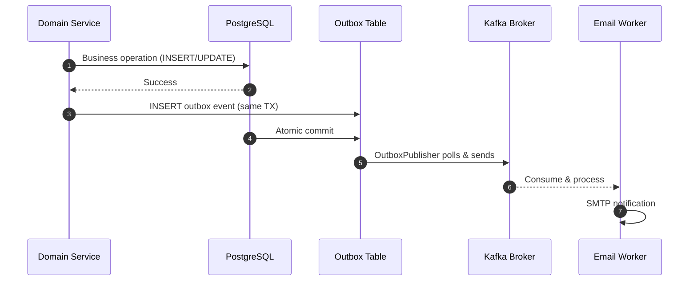

### Consumer Architecture

| Consumer | Processing | Deduplication | Failure Handling |
|----------|------------|---------------|------------------|
| **EmailWorker** | Manual commit + DLQ | Redis dedup (24h TTL) | Retry → DLQ after max attempts |
| **Stats Writer** | Idempotent ClickHouse insert | Event ID dedup | Log + skip |

---

## ClickHouse Analytics Layer

A dedicated **3-component analytics pipeline** provides real-time business intelligence without impacting the transactional PostgreSQL database.

### Architecture

| Component | Port | Role |
|-----------|------|------|
| **stats-reader** | `:9029` (gRPC), `:8096` (HTTP) | Query ClickHouse via HTTP, serves gRPC analytics endpoints |
| **stats-writer** | `:9030` (Kafka consumer) | Consumes Kafka events, deduplicates, buffers, writes to ClickHouse |
| **stats-backfill** | `:9031` (CLI) | Historical backfill from PostgreSQL outbox → Kafka → ClickHouse |

### Query Flow

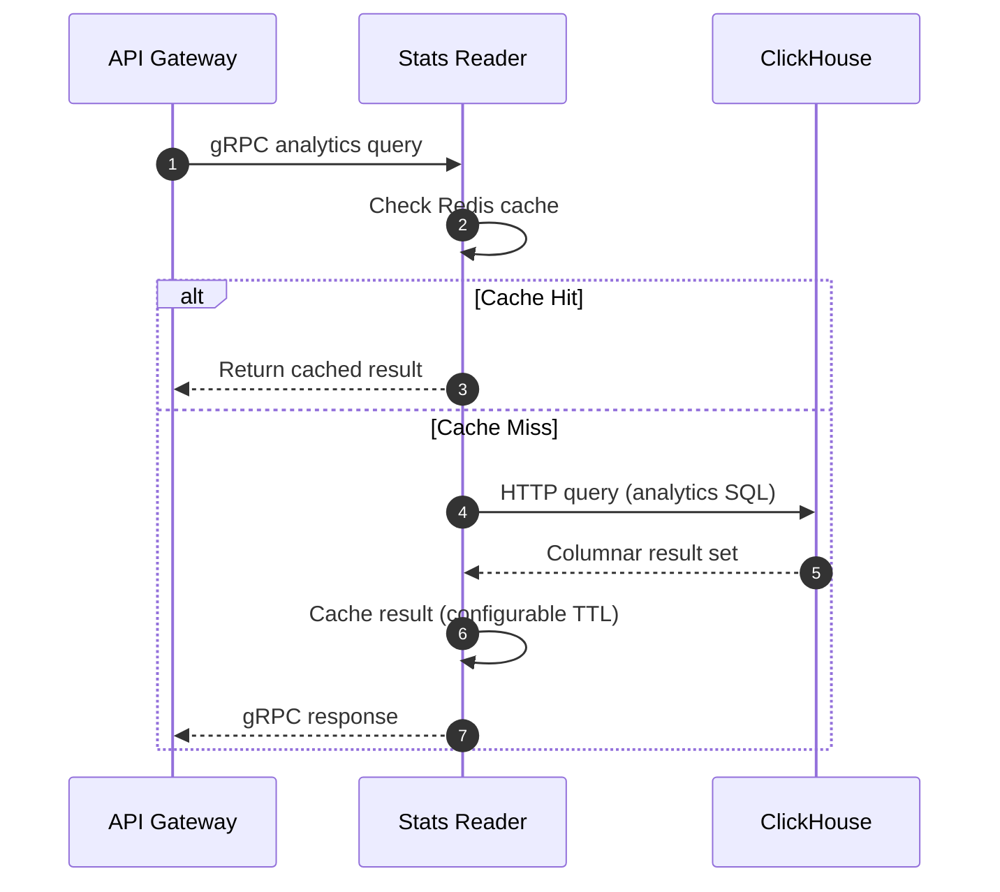

### Stats Reader Handlers

| Handler | Query Domain | Description |
|---------|-------------|-------------|
| **OrderTotalRevenueHandler** | Orders | Monthly/yearly total revenue |
| **OrderSoldoutHandler** | Orders | Sold-out product tracking |
| **TransactionStatsAmountHandler** | Transactions | Transaction amount statistics |
| **TransactionStatsMethodHandler** | Transactions | Transaction method breakdown |
| **TransactionStatsStatusHandler** | Transactions | Transaction status distribution |
| **CashierSalesHandler** | Cashiers | Cashier sales performance |
| **CashierTotalSalesHandler** | Cashiers | Cashier total sales volume |
| **CategoryPriceHandler** | Categories | Category price analysis |
| **CategoryTotalPriceHandler** | Categories | Category total price breakdown |

### Stats Writer Pipeline

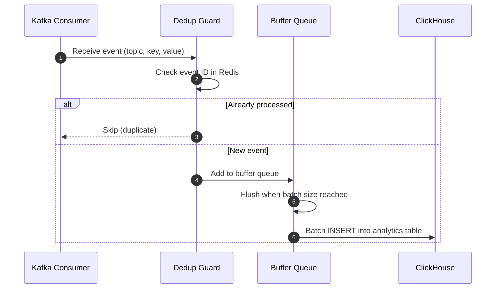

---

## Deployment Architectures

### Docker Compose (Local Development)

The Docker Compose configuration provisions PostgreSQL, Redis, Kafka, ClickHouse, and observability containers. Java services run as independent JVM processes on the host for faster development iteration.

```mermaid
flowchart TB
    classDef gateway fill:#1e293b,stroke:#22d3ee,color:#cffafe,stroke-width:2px,font-weight:bold
    classDef core fill:#1e1b4b,stroke:#a78bfa,color:#ede9fe,stroke-width:1.5px
    classDef infra fill:#172554,stroke:#60a5fa,color:#dbeafe,stroke-width:1.5px
    classDef obs fill:#052e16,stroke:#4ade80,color:#dcfce7,stroke-width:1.5px
    classDef event fill:#431407,stroke:#fb923c,color:#fed7aa,stroke-width:1.5px

    subgraph DockerCompose["docker-compose.yml — Local Environment"]

        subgraph Gateway["API Gateway"]
            NGINX["NGINX Proxy :80"]:::gateway
            APIGW["API Gateway Container<br/>Quarkus GraphQL Gateway :5000"]:::gateway
        end

        subgraph Services["Core Service Containers"]
            subgraph Identity["Identity & Access"]
                AUTH["auth-service"]:::core
                USER["user-service"]:::core
                ROLE["role-service"]:::core
            end

            subgraph MerchantSuite["Merchant Domain"]
                MERCH["merchant-service"]:::core
            end

            subgraph RetailSuite["Retail Domain"]
                CASHIER["cashier-service"]:::core
                CATEGORY["category-service"]:::core
                PRODUCT["product-service"]:::core
            end

            subgraph MovementsSuite["Checkout & Sales"]
                ORDER["order-service"]:::core
                ORDER_ITEM["order-item-service"]:::core
                TXN["transaction-service"]:::core
            end
        end

        subgraph Infra["Infrastructure Suite"]
            PG[("PostgreSQL :5432")]:::infra
            REDIS[("Redis :6381")]:::infra
            KAFKA[("Kafka Broker :9092")]:::infra
            CLICKHOUSE[("ClickHouse :8123")]:::infra
        end

        subgraph Obs["Observability Stack"]
            PROM["Prometheus :9090"]:::obs
            GRAFANA["Grafana :3000"]:::obs
            LOKI["Loki :3100"]:::obs
            JAEGER["Jaeger :16686"]:::obs
            OTEL["OTel Collector :4317"]:::obs
            NODEX["Node Exporter"]:::obs
            KAFKAX["Kafka Exporter"]:::obs
            PGX["Postgres Exporter"]:::obs
            PROMTAIL["Promtail Log Shipper"]:::obs
        end

        subgraph Events["Event Consumers"]
            EMAIL["Email Worker"]:::event
        end
    end

    NGINX --> APIGW

    APIGW -->|gRPC| AUTH
    APIGW -->|gRPC| USER
    APIGW -->|gRPC| ROLE
    APIGW -->|gRPC| MERCH
    APIGW -->|gRPC| CASHIER
    APIGW -->|gRPC| CATEGORY
    APIGW -->|gRPC| PRODUCT
    APIGW -->|gRPC| ORDER
    APIGW -->|gRPC| ORDER_ITEM
    APIGW -->|gRPC| TXN

    AUTH -->|SQL| PG
    USER -->|SQL| PG
    ROLE -->|SQL| PG
    MERCH -->|SQL| PG
    CASHIER -->|SQL| PG
    CATEGORY -->|SQL| PG
    PRODUCT -->|SQL| PG
    ORDER -->|SQL| PG
    ORDER_ITEM -->|SQL| PG
    TXN -->|SQL| PG

    AUTH -->|Cache| REDIS
    USER -->|Cache| REDIS
    ROLE -->|Cache| REDIS
    MERCH -->|Cache| REDIS
    CASHIER -->|Cache| REDIS
    PRODUCT -->|Cache| REDIS
    APIGW --> REDIS_CLUSTER

    AUTH -->|gRPC| USER
    AUTH -->|gRPC| ROLE
    MERCH -->|gRPC| USER
    CASHIER -->|gRPC| USER
    ORDER -->|gRPC| PRODUCT
    ORDER -->|gRPC| TXN

    ORDER -->|Events| KAFKA

    KAFKA --> EMAIL

    AUTH -.->|"Metrics"| PROM
    USER -.->|"Metrics"| PROM
    ROLE -.->|"Metrics"| PROM
    MERCH -.->|"Metrics"| PROM
    CASHIER -.->|"Metrics"| PROM
    CATEGORY -.->|"Metrics"| PROM
    PRODUCT -.->|"Metrics"| PROM
    ORDER -.->|"Metrics"| PROM
    TXN -.->|"Metrics"| PROM
    APIGW -.->|"Metrics"| PROM

    AUTH -.->|"Traces"| OTEL
    USER -.->|"Traces"| OTEL
    ROLE -.->|"Traces"| OTEL
    MERCH -.->|"Traces"| OTEL
    CASHIER -.->|"Traces"| OTEL
    CATEGORY -.->|"Traces"| OTEL
    PRODUCT -.->|"Traces"| OTEL
    ORDER -.->|"Traces"| OTEL
    TXN -.->|"Traces"| OTEL
    APIGW -.->|"Traces"| OTEL

    OTEL -.-> JAEGER
    PROMTAIL -.-> LOKI
    PROM -.-> GRAFANA
    LOKI -.-> GRAFANA

    KAFKA -.-> KAFKAX
    PG -.-> PGX
    KAFKAX -.-> PROM
    PGX -.-> PROM
    NODEX -.-> PROM
```

---

### Kubernetes (Production Clustering)

The production-grade Kubernetes architecture is designed for high availability, fault tolerance, and seamless horizontal scaling. All manifests are defined inside the custom `point-of-sale` namespace, route edge traffic using NGINX pods acting as a LoadBalancer, and manage service scalability using individual HPAs.

```mermaid
flowchart TB
    classDef client fill:#0f172a,stroke:#38bdf8,color:#e0f2fe,stroke-width:2px,font-weight:bold
    classDef ingress fill:#0f172a,stroke:#06b6d4,color:#e0f7fa,stroke-width:2px,font-weight:bold
    classDef k8sSvc fill:#1e293b,stroke:#22d3ee,color:#cffafe,stroke-width:2px,font-weight:bold
    classDef pod fill:#1e1b4b,stroke:#a78bfa,color:#ede9fe,stroke-width:1.5px
    classDef stateful fill:#172554,stroke:#60a5fa,color:#dbeafe,stroke-width:1.5px
    classDef hpa fill:#064e3b,stroke:#34d399,color:#ecfdf5,stroke-width:1px,stroke-dasharray: 5 5
    classDef obs fill:#052e16,stroke:#4ade80,color:#dcfce7,stroke-width:1.5px

    Client["Client Applications<br/>(HTTPS Requests)"]:::client

    subgraph K8sCluster["Kubernetes Cluster — Namespace: point-of-sale"]
        direction TB

        subgraph IngressLayer["Edge Reverse Proxy (NGINX)"]
            NGINX_SVC["nginx-service<br/>(LoadBalancer :80)"]:::k8sSvc
            NGINX_POD["nginx-pods"]:::pod
        end

        subgraph GatewayServices["GraphQL API Gateway (Scalable Deployment)"]
            APIGW_SVC["apigateway-service<br/>(ClusterIP :5000)"]:::k8sSvc
            APIGW_PODS["apigateway-pods"]:::pod
            APIGW_HPA["apigateway-hpa"]:::hpa
        end

        subgraph DomainServices["Internal gRPC Microservices"]
            direction TB

            subgraph IdentityZone["Identity Suite"]
                AUTH_POD["auth-pods"]:::pod
                USER_POD["user-pods"]:::pod
                ROLE_POD["role-pods"]:::pod
                AUTH_SVC["auth-service (gRPC)"]:::k8sSvc
                USER_SVC["user-service (gRPC)"]:::k8sSvc
                ROLE_SVC["role-service (gRPC)"]:::k8sSvc
            end

            subgraph MerchantZone["Merchant Suite"]
                MERCH_POD["merchant-pods"]:::pod
                MERCH_SVC["merchant-service (gRPC)"]:::k8sSvc
            end

            subgraph RetailZone["Retail & Taxonomy"]
                CASHIER_POD["cashier-pods"]:::pod
                CATEGORY_POD["category-pods"]:::pod
                PRODUCT_POD["product-pods"]:::pod
                CASHIER_SVC["cashier-service (gRPC)"]:::k8sSvc
                CATEGORY_SVC["category-service (gRPC)"]:::k8sSvc
                PRODUCT_SVC["product-service (gRPC)"]:::k8sSvc
            end

            subgraph MovementsZone["Ledgers & Orders"]
                ORDER_POD["order-pods"]:::pod
                TX_POD["transaction-pods"]:::pod
                ORDER_SVC["order-service (gRPC)"]:::k8sSvc
                TX_SVC["transaction-service (gRPC)"]:::k8sSvc
            end

            PodsHPA["Domain Services HPAs<br/>(auth, product, order, etc.)"]:::hpa
        end

        subgraph DataObservability["Infrastructure & Databases"]
            PG_SVC["postgres-service<br/>(ClusterIP :5432)"]:::k8sSvc
            PG_POD["postgres-pods"]:::pod

            REDIS_SVC["redis-service<br/>(ClusterIP :6381)"]:::k8sSvc
            REDIS_POD["redis-pod"]:::pod

            KAFKA_SVC["kafka-service<br/>(ClusterIP :9092)"]:::k8sSvc
            KAFKA_POD["kafka-pods"]:::pod

            CH_SVC["clickhouse-service<br/>(ClusterIP :8123)"]:::k8sSvc
            CH_POD["clickhouse-pod"]:::pod
        end

        subgraph BackgroundWorkers["Event Consumers"]
            EMAIL_SVC["email-service<br/>(ClusterIP)"]:::k8sSvc
            EMAIL_PODS["email-pods"]:::pod
            EMAIL_HPA["email-hpa"]:::hpa
        end

        subgraph K8sObs["Observability Namespace Suite"]
            PROM_SVC["prometheus-service<br/>(ClusterIP :9090)"]:::k8sSvc
            PROM_POD["prometheus-pod"]:::pod

            OTEL_SVC["otel-collector-service<br/>(ClusterIP :4317)"]:::k8sSvc
            OTEL_POD["otel-collector-pod"]:::pod

            LOKI_SVC["loki-service<br/>(ClusterIP :3100)"]:::k8sSvc
            LOKI_POD["loki-pod"]:::pod

            JAEGER_SVC["jaeger-service<br/>(ClusterIP :16686)"]:::k8sSvc
            JAEGER_POD["jaeger-pod"]:::pod

            GRAFANA_SVC["grafana-service<br/>(ClusterIP :3000)"]:::k8sSvc
            GRAFANA_POD["grafana-pod"]:::pod

            ALERTMGR_SVC["alertmanager-service<br/>(ClusterIP :9093)"]:::k8sSvc
            ALERTMGR_POD["alertmanager-pod"]:::pod

            PROMTAIL["promtail-daemonset"]:::pod

            KAFKAX_SVC["kafka-exporter-service"]:::k8sSvc
            KAFKAX_POD["kafka-exporter-pod"]:::pod

            NODEX_SVC["node-exporter-service"]:::k8sSvc
            NODEX_POD["node-exporter-daemonset"]:::pod
        end
    end

    Client -->|HTTPS :443| NGINX_SVC
    NGINX_SVC --> NGINX_POD
    NGINX_POD -->|Proxy Pass| APIGW_SVC
    APIGW_SVC --> APIGW_PODS
    APIGW_HPA -.->|Autoscales| APIGW_PODS

    APIGW_PODS -->|gRPC call| AUTH_SVC
    APIGW_PODS -->|gRPC call| USER_SVC
    APIGW_PODS -->|gRPC call| ROLE_SVC
    APIGW_PODS -->|gRPC call| MERCH_SVC
    APIGW_PODS -->|gRPC call| CASHIER_SVC
    APIGW_PODS -->|gRPC call| CATEGORY_SVC
    APIGW_PODS -->|gRPC call| PRODUCT_SVC
    APIGW_PODS -->|gRPC call| ORDER_SVC
    APIGW_PODS -->|gRPC call| TX_SVC

    AUTH_SVC --> AUTH_POD
    USER_SVC --> USER_POD
    ROLE_SVC --> ROLE_POD
    MERCH_SVC --> MERCH_POD
    CASHIER_SVC --> CASHIER_POD
    CATEGORY_SVC --> CATEGORY_POD
    PRODUCT_SVC --> PRODUCT_POD
    ORDER_SVC --> ORDER_POD
    TX_SVC --> TX_POD

    AUTH_POD -->|SQL| PG_SVC
    USER_POD -->|SQL| PG_SVC
    ROLE_POD -->|SQL| PG_SVC
    MERCH_POD -->|SQL| PG_SVC
    CASHIER_POD -->|SQL| PG_SVC
    CATEGORY_POD -->|SQL| PG_SVC
    PRODUCT_POD -->|SQL| PG_SVC
    ORDER_POD -->|SQL| PG_SVC
    TX_POD -->|SQL| PG_SVC

    PG_SVC --> PG_POD

    AUTH_POD -->|Cache| REDIS_SVC
    USER_POD -->|Cache| REDIS_SVC
    ROLE_POD -->|Cache| REDIS_SVC
    MERCH_POD -->|Cache| REDIS_SVC
    CASHIER_POD -->|Cache| REDIS_SVC
    PRODUCT_POD -->|Cache| REDIS_SVC

    REDIS_SVC --> REDIS_POD

    AUTH_POD -->|gRPC| USER_SVC
    AUTH_POD -->|gRPC| ROLE_SVC
    MERCH_POD -->|gRPC| USER_SVC
    CASHIER_POD -->|gRPC| USER_SVC
    ORDER_POD -->|gRPC| PRODUCT_SVC
    ORDER_POD -->|gRPC| TX_SVC

    ORDER_POD -->|Events| KAFKA_SVC

    KAFKA_SVC --> KAFKA_POD
    KAFKA_POD -->|Message Stream| EMAIL_SVC
    EMAIL_SVC --> EMAIL_PODS

    EMAIL_HPA -.->|Autoscales| EMAIL_PODS

    PodsHPA -.->|Autoscales| AUTH_POD
    PodsHPA -.->|Autoscales| USER_POD
    PodsHPA -.->|Autoscales| ROLE_POD
    PodsHPA -.->|Autoscales| MERCH_POD
    PodsHPA -.->|Autoscales| CASHIER_POD
    PodsHPA -.->|Autoscales| CATEGORY_POD
    PodsHPA -.->|Autoscales| PRODUCT_POD
    PodsHPA -.->|Autoscales| ORDER_POD
    PodsHPA -.->|Autoscales| TX_POD

    AUTH_POD -.->|"Metrics"| PROM_SVC
    USER_POD -.->|"Metrics"| PROM_SVC
    ROLE_POD -.->|"Metrics"| PROM_SVC
    MERCH_POD -.->|"Metrics"| PROM_SVC
    CASHIER_POD -.->|"Metrics"| PROM_SVC
    CATEGORY_POD -.->|"Metrics"| PROM_SVC
    PRODUCT_POD -.->|"Metrics"| PROM_SVC
    ORDER_POD -.->|"Metrics"| PROM_SVC
    TX_POD -.->|"Metrics"| PROM_SVC
    APIGW_PODS -.->|"Metrics"| PROM_SVC

    AUTH_POD -.->|"Traces"| OTEL_SVC
    USER_POD -.->|"Traces"| OTEL_SVC
    ROLE_POD -.->|"Traces"| OTEL_SVC
    MERCH_POD -.->|"Traces"| OTEL_SVC
    CASHIER_POD -.->|"Traces"| OTEL_SVC
    CATEGORY_POD -.->|"Traces"| OTEL_SVC
    PRODUCT_POD -.->|"Traces"| OTEL_SVC
    ORDER_POD -.->|"Traces"| OTEL_SVC
    TX_POD -.->|"Traces"| OTEL_SVC
    APIGW_PODS -.->|"Traces"| OTEL_SVC

    PROM_SVC --> PROM_POD
    OTEL_SVC --> OTEL_POD
    LOKI_SVC --> LOKI_POD
    JAEGER_SVC --> JAEGER_POD
    GRAFANA_SVC --> GRAFANA_POD
    ALERTMGR_SVC --> ALERTMGR_POD

    OTEL_POD -.-> JAEGER_SVC
    PROMTAIL -.-> LOKI_SVC
    PROM_POD -.-> GRAFANA_SVC
    LOKI_POD -.-> GRAFANA_SVC
    PROM_POD -.-> ALERTMGR_SVC

    KAFKA_SVC -.-> KAFKAX_SVC
    KAFKAX_SVC --> KAFKAX_POD
    KAFKAX_POD -.-> PROM_SVC
    NODEX_SVC --> NODEX_POD
    NODEX_POD -.-> PROM_SVC
```

### ArgoCD App-of-Apps GitOps Architecture

The platform follows GitOps best practices using ArgoCD for declarative continuous deployments. Replicating the App-of-Apps design pattern, a root Application (`point-of-sale-root`) automatically manages and tracks the states of individual child Applications mapping to Kustomize bases.

Sync waves (`argocd.argoproj.io/sync-wave` annotations) are strictly defined to guarantee database migrations run and complete before domain applications start.

```mermaid
graph TD
    classDef root fill:#1e293b,stroke:#22d3ee,color:#cffafe,stroke-width:2.5px,font-weight:bold
    classDef proj fill:#0f172a,stroke:#38bdf8,color:#e0f2fe,stroke-width:2px
    classDef app fill:#1e1b4b,stroke:#a78bfa,color:#ede9fe,stroke-width:1.5px
    classDef wave fill:#1c1917,stroke:#f59e0b,color:#fef3c7,stroke-width:1.5px
    classDef base fill:#052e16,stroke:#34d399,color:#dcfce7,stroke-width:1.5px

    RootApp["point-of-sale-root<br/>(ArgoCD Root Application)"]:::root
    AppProj["pos<br/>(ArgoCD AppProject)"]:::proj

    %% Root to Project mapping
    RootApp --> AppProj

    %% Sync Waves Grouping
    subgraph Waves["ArgoCD Sync Waves Sequence"]
        direction TB

        subgraph Wave1["Wave 1: Core Foundation & Infrastructure"]
            W1_Common["common<br/>(deployments/kubernetes/base/common)"]:::base
            W1_Postgres["infra-postgres<br/>(deployments/kubernetes/base/postgres)"]:::base
            W1_Redis["infra-redis<br/>(deployments/kubernetes/base/redis)"]:::base
            W1_Kafka["infra-kafka<br/>(deployments/kubernetes/base/kafka)"]:::base
            W1_Obs["observability<br/>(deployments/kubernetes/base/observability)"]:::base
        end

        subgraph Wave2["Wave 2: Database Migration"]
            W2_Migrate["db-migration<br/>(deployments/kubernetes/base/db-migration)"]:::base
        end

        subgraph Wave3["Wave 3: Core Domain Services (gRPC/HTTP)"]
            W3_Auth["service-auth<br/>(deployments/kubernetes/base/auth)"]:::base
            W3_User["service-user<br/>(deployments/kubernetes/base/user)"]:::base
            W3_Role["service-role<br/>(deployments/kubernetes/base/role)"]:::base
            W3_Product["service-product<br/>(deployments/kubernetes/base/product)"]:::base
            W3_Category["service-category<br/>(deployments/kubernetes/base/category)"]:::base
            W3_Merchant["service-merchant<br/>(deployments/kubernetes/base/merchant)"]:::base
            W3_Order["service-order<br/>(deployments/kubernetes/base/order)"]:::base
            W3_Cashier["service-cashier<br/>(deployments/kubernetes/base/cashier)"]:::base
            W3_OrderItem["service-order-item<br/>(deployments/kubernetes/base/order_item)"]:::base
            W3_Email["service-email<br/>(deployments/kubernetes/base/email)"]:::base
        end

        subgraph Wave4["Wave 4: Financial Ledgers"]
            W4_Tx["service-transaction<br/>(deployments/kubernetes/base/transaction)"]:::base
        end

        subgraph Wave5["Wave 5: API Edge Gateway"]
            W5_Gate["apigateway<br/>(deployments/kubernetes/base/apigateway)"]:::base
        end

        subgraph Wave6["Wave 6: Ingress Control"]
            W6_Nginx["nginx<br/>(deployments/kubernetes/base/nginx)"]:::base
        end
    end

    AppProj --> Wave1
    Wave1 --> Wave2
    Wave2 --> Wave3
    Wave3 --> Wave4
    Wave4 --> Wave5
    Wave5 --> Wave6
```

### GitOps Application Registry

The directory layout under [deployments/gitops/argocd/](file:///home/hoover/Projects/java/quarkus-grpc-pointofsale/deployments/gitops/argocd/) manages these deployments:

1. **Root Application**: [root-app.yaml](file:///home/hoover/Projects/java/quarkus-grpc-pointofsale/deployments/gitops/argocd/root-app.yaml) bootstraps the GitOps sequence, pointing directly to the child applications namespace registry under `/apps`.
2. **Project Specification**: [project.yaml](file:///home/hoover/Projects/java/quarkus-grpc-pointofsale/deployments/gitops/argocd/project.yaml) defines the target cluster destinations, namespace whitelists (e.g., `pos` and `pointofsale`), and cluster resources access controls.
3. **Application Definitions**: [apps/](file:///home/hoover/Projects/java/quarkus-grpc-pointofsale/deployments/gitops/argocd/apps/) contains the declaration manifests for all 19 component applications.

---

## Technology Stack

| Category              | Selected Technologies        | Purpose                                                          |
| :-------------------- | :--------------------------- | :--------------------------------------------------------------- |
| **Language**          | Java 21 (Quarkus v3.31.3)    | Reactive, non-blocking asynchronous Java execution.              |
| **API Edge Gateway**  | Quarkus SmallRye GraphQL    | Reactive GraphQL API Gateway router and reverse proxy destination.  |
| **RPC Inter-service** | Quarkus gRPC Client & Server | Blazing fast, contract-first synchronous gRPC communication.     |
| **Database**          | PostgreSQL v17               | Safe ACID ledger persistent storage system (direct per-service connections). |
| **Analytics DB**      | ClickHouse                  | Columnar analytics database for real-time business intelligence. |
| **DB Migrations**     | Flyway                       | Incremental database schema version manager run on startup.      |
| **Caching Tier**      | Redis Standalone             | High-performance key-value cache layer with per-service pools.   |
| **Messaging Stream**  | Apache Kafka                 | Asynchronous high-throughput messaging event bus (KRaft mode).   |
| **Token Manager**     | JWT                          | Secure stateless request authentication standard.                |
| **Observability**     | OpenTelemetry + Jaeger       | Vendor-neutral distributed telemetry pipeline and visualization. |
| **Docker Engine**     | Compose                      | Local environment virtualization orchestration.                  |
| **Orchestrator**      | Kubernetes                   | Production-scale auto-scaling pod clustering infrastructure.     |

---

## Getting Started

### Prerequisites

Ensure the following system packages are locally configured:

- [Git](https://git-scm.com/)
- [Java Development Kit (JDK 21+)](https://adoptium.net/)
- [Apache Maven](https://maven.apache.org/) (v3.9+)
- [Docker](https://www.docker.com/) & [Docker Compose](https://docs.docker.com/compose/)
- [Protobuf Compiler](https://grpc.io/docs/protoc-installation/) (optional)

### 1. Clone the Workspace

```sh
git clone https://github.com/MamangRust/modular-monolith-quarkus-point-of-sale.git
cd modular-monolith-quarkus-point-of-sale
```

### 2. Prepare Environment Configurations

Setup the system configurations from placeholders:

```sh
# Copy root variables
cp .env.example .env

# Copy local docker settings overrides
cp deployments/local/docker.env.example deployments/local/docker.env
```

### 3. Build the Maven Project

Compile all submodules and build the executable JAR files:

```sh
mvn clean install
```

### 4. Start Infrastructure and Services

Start infrastructure containers (PostgreSQL, Redis, Kafka, ClickHouse), then run Java services as independent JVM processes:

```sh
# Start infrastructure containers
docker compose -f deployments/local/docker-compose.infra.yml up -d

# Start all Java services as host processes
bash e2e/start-local.sh
```

Each service starts as an independent JVM with its own gRPC server, Flyway migrations, and Agroal connection pool. Flyway migrations run automatically on service startup.

To verify all services are healthy:

```sh
# Check all service health endpoints
for port in 9000 9011 9012 9005 9003 9015 9016 9017 9018 9019 9025 9029; do
  curl -sf http://localhost:$port/q/health && echo " :$port OK" || echo ":$port FAIL"
done
```

---

## Port Map Registry

| Application/Service             | Port Configuration / URL                                                        |
| :------------------------------ | :------------------------------------------------------------------------------ |
| **NGINX Reverse Proxy Edge**    | [http://localhost](http://localhost)                                            |
| **API Gateway GraphQL**         | [http://localhost:5000/graphql](http://localhost:5000/graphql)                  |
| **Auth Service (gRPC)**         | `localhost:9000`                                                                |
| **User Service (gRPC)**         | `localhost:9011`                                                                |
| **Role Service (gRPC)**         | `localhost:9012`                                                                |
| **Merchant Service (gRPC)**     | `localhost:9005`                                                                |
| **Cashier Service (gRPC)**      | `localhost:9003`                                                                |
| **Category Service (gRPC)**     | `localhost:9015`                                                                |
| **Product Service (gRPC)**      | `localhost:9016`                                                                |
| **Order Service (gRPC)**        | `localhost:9017`                                                                |
| **Order Item Service (gRPC)**   | `localhost:9018`                                                                |
| **Transaction Service (gRPC)**  | `localhost:9019`                                                                |
| **Stats Reader (gRPC)**         | `localhost:9029`                                                                |
| **Grafana Dashboard Portal**    | [http://localhost:3000](http://localhost:3000) _(Credentials: `admin`/`admin`)_ |
| **Prometheus Telemetry**        | [http://localhost:9090](http://localhost:9090)                                  |
| **Jaeger Distributed Tracing**  | [http://localhost:16686](http://localhost:16686)                                |
| **ClickHouse Analytics**        | `localhost:8123`                                                                |
| **PostgreSQL Database Engine**  | `localhost:5432`                                                                |
| **Redis Standalone**            | `localhost:6381`                                                                |
| **Kafka Broker**               | `localhost:9092`                                                                |

To stop all services and infrastructure:

```sh
# Stop Java services
pkill -f 'quarkus-run'

# Stop infrastructure
docker compose -f deployments/local/docker-compose.infra.yml down -v
```

---

## Maven & Shell Commands Reference

| Command                                                                    | Scope                                                                                                     |
| :------------------------------------------------------------------------- | :-------------------------------------------------------------------------------------------------------- |
| `mvn clean install`                                                        | Cleans target directories, runs tests, compiles all submodules, and generates package JARs.               |
| `mvn compile`                                                              | Compiles raw Java source files for all modules.                                                           |
| `./build-docker-images.sh`                                                 | Orchestrates the build of Docker images for all Quarkus microservices.                                    |
| `docker compose -f deployments/local/docker-compose.infra.yml up -d` | Launches infrastructure containers (PostgreSQL, Redis, Kafka, ClickHouse, observability). |
| `bash e2e/start-local.sh`                                             | Starts all Java services as independent JVM processes on the host.                      |
| `docker compose -f deployments/local/docker-compose.infra.yml down`  | Stops infrastructure containers, releasing networks.                                    |
| `pkill -f 'quarkus-run'`                                             | Stops all running Quarkus service processes.                                            |

---

## Workspace Directory Tree

```
quarkus-point-of-sale/
├── pom.xml                         # Root Maven Parent POM
├── common/src/main/proto/          # Protobuf contracts (11 domains)
│   ├── auth.proto                  #   Identity tokens contracts
│   ├── cashier/                    #   Cashier and staff configurations
│   ├── category/                   #   Product category declarations
│   ├── common/                     #   Shared protobuf data types
│   ├── merchant/                   #   Merchant account declarations
│   ├── merchant_document/          #   Verification files specifications
│   ├── order/                      #   Order and payment details
│   ├── order_item/                 #   Detailed items list configurations
│   ├── product/                    #   Product CRUD and inventory properties
│   ├── role/                       #   Role mapping specifications
│   ├── transaction/                #   General audit register specifications
│   └── user/                       #   User CRUD data properties
├── common/                         # Shared Maven library Module
│   └── src/main/java/com/sanedge/common/
│       ├── config/                 #   AppConfig, JwtConfig, RedisConfig, FlywayConfig
│       ├── observability/          #   TracingMetrics config
│       ├── service/                #   RedisService utilities
│       └── pb/                     #   Compiled Java Protobuf gRPC stubs
├── gateway/                        # GraphQL API Gateway (GraphQL → gRPC proxy, port :5000)
├── auth/                           # Authentication engine service
├── user/                           # User profiles service (CQRS)
├── role/                           # RBAC authorization service
├── merchant/                       # Merchant onboarding & reports service
├── cashier/                        # Cashier & staff management service
├── category/                       # Category management service
├── product/                        # Product & inventory service
├── order/                          # Order and billing service
├── order_item/                     # Order items listing service
├── transaction/                    # Central transaction ledger audit service
├── email-service/                  # Asynchronous Kafka notifications service
├── seeder/                         # Database seeder for initial data
├── stats-reader/                   # ClickHouse query service (gRPC :9029)
├── stats-writer/                   # ClickHouse write pipeline (Kafka consumer)
├── stats-backfill/                 # Historical data backfill job
├── deployments/
│   ├── local/                      #   Docker compose infrastructure files
│   └── kubernetes/                 #   Production K8s deployment manifests
├── observability/                  #   Telemetry pipelines configurations (Loki, OTEL, Alertmanager)
├── grafana/                        #   Pre-configured dashboard JSON files
├── nginx/                          #   Reverse-proxy NGINX rules
└── images/                         #   Architecture diagrams & dashboard screenshots
```

---

## License

This project is open-sourced under the MIT License for educational and development purposes.

---

<p align="center">
  Built with Java, Quarkus, gRPC, Apache Kafka, ClickHouse, and a passion for high-performance reactive microservices.
</p>
